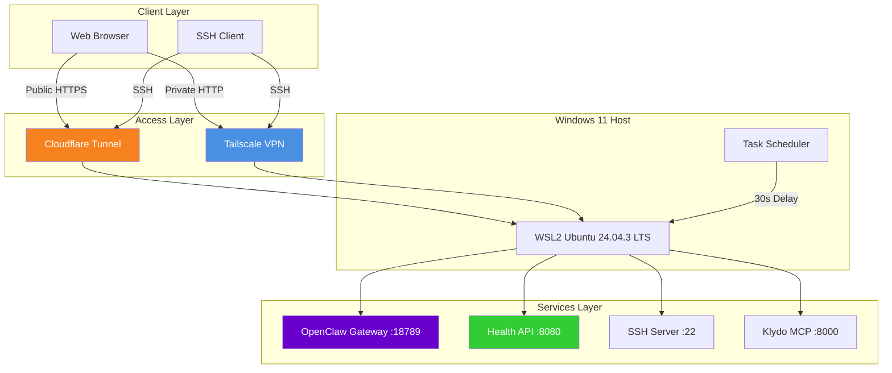
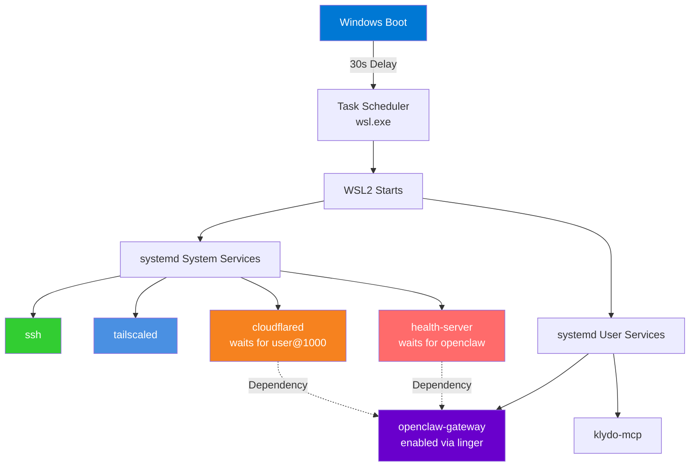
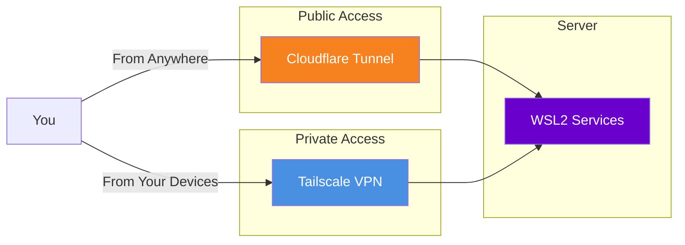

# 🤖 ASUS-VivoBookS15 AI Server

> An old laptop, reborn as an AI agent orchestration hub with private VPN access, public tunnel reach, and 24/7 health monitoring.

[](https://health.droidvm.dev)
[](https://health.droidvm.dev)
[](https://openclaw.droidvm.dev)
[](https://health.droidvm.dev)
[](https://learn.microsoft.com/en-us/windows/wsl/)
[](LICENSE)

---

## The Setup

This is **not your average home server**. It's a WSL2-based AI orchestration platform that:

- 🔄 **Auto-starts on Windows boot** — No manual intervention needed
- 🌐 **Accessible from anywhere** — Private VPN + public tunnel
- 💚 **Self-monitoring** — Health API with connectivity checks
- 🤖 **Runs AI agents** — OpenClaw (Lexi) with web dashboard control
- 🛠️ **Claude Code powered** — AI-assisted development environment

---

## Architecture Overview



---

## Service Stack

| Component | What | How |
|-----------|------|-----|
| **Hardware** | ASUS VivoBook S15 | Intel i5-12500H (12 cores), 16GB RAM |
| **OS** | Ubuntu 24.04.3 LTS | Running on WSL2 (12GB RAM allocated) |
| **AI** | OpenClaw v2026.2.26 | "Lexi" — autonomous AI agent |
| **VPN** | Tailscale | Private mesh network (100.85.179.13) |
| **Tunnel** | cloudflared | Public access via droidvm.dev |
| **Health** | Custom Python API | Real-time monitoring at `/health` |
| **Dev** | Claude Code | AI-powered development CLI |

---

## Services at a Glance

| Service | Port | Access | Purpose |
|---------|------|--------|---------|
| **OpenClaw Gateway** | 18789 | [openclaw.droidvm.dev](https://openclaw.droidvm.dev) | AI agent dashboard |
| **Health API** | 8080 | [health.droidvm.dev](https://health.droidvm.dev) | System monitoring |
| **SSH Server** | 22 | [ssh.droidvm.dev](ssh://ssh.droidvm.dev) | Remote shell |
| **Klydo MCP** | 8000 | [klydo-mcp.droidvm.dev](https://klydo-mcp.droidvm.dev) | Fashion search |
| **Tailscale** | 41641 | `asus-vivobooks15-1` | Private VPN |

---

## Auto-Start Chain



---

## Dual Access Layer



**Tailscale** — Secure, keyless SSH within your tailnet
**Cloudflare** — Public access from anywhere in the world

---

## Access Your Server

### From Anywhere (Public)

```bash
# SSH via Cloudflare Tunnel
ssh lextex@ssh.droidvm.dev

# Check health status
curl https://health.droidvm.dev | jq .

# Access AI dashboard
open https://openclaw.droidvm.dev
```

### From Your Network (Private via Tailscale)

```bash
# SSH via VPN
ssh lextex@asus-vivobooks15-1
# or by IP:
ssh lextex@100.85.179.13

# Direct access to services
http://100.85.179.13:18789  # OpenClaw
http://100.85.179.13:8080   # Health API
```

---

## Health Monitor

The server runs a custom health monitoring API at [`https://health.droidvm.dev`](https://health.droidvm.dev).

**What it checks:**

- ✅ System uptime & load averages
- ✅ Memory & disk usage
- ✅ Service status (SSH, Tailscale, Cloudflare, OpenClaw)
- ✅ OpenClaw gateway connectivity & response time
- ✅ External connectivity (DNS servers)

**Sample output:**

```json
{
  "host": "ASUS-VivoBookS15",
  "status": "healthy",
  "uptime": "5d 12h 30m",
  "load": {"1m": 0.42, "5m": 0.35, "15m": 0.28},
  "memory": {
    "total_mb": 11750,
    "used_mb": 2847,
    "available_mb": 8903,
    "usage_pct": 24.2
  },
  "overall_healthy": true
}
```

---

## AI Agent: OpenClaw (Lexi)

The server runs **OpenClaw**, an autonomous AI agent that you control via a web dashboard.

**Access:** [`https://openclaw.droidvm.dev`](https://openclaw.droidvm.dev)

**Capabilities:**
- 🧠 Multi-model AI (Zai, Groq, Ollama)
- 💬 Messaging integration (WhatsApp, Telegram)
- 🔌 MCP server support
- 🎯 Custom skills and tools

**First-time setup:**
1. Open the dashboard
2. Approve the device pairing from the server:
   ```bash
   openclaw devices list
   openclaw devices approve <request-id>
   ```

---

## What Makes This Legendary

### 1. WSL2 as a Server Platform
Running a full server stack on WSL2 is unconventional, but it works beautifully:
- **Windows integration** — Auto-start via Task Scheduler
- **Linux power** — Full systemd, containers, native tooling
- **Resource flexibility** — Adjustable RAM/CPU via `.wslconfig`

### 2. Health-First Design
Every service is monitored:
- **Passive checks** — Is the process running?
- **Active checks** — Can we reach the HTTP endpoint?
- **Dependency checks** — Are required services up first?

The health API even validates **external connectivity** by checking DNS servers.

### 3. Claude Code Integration
Development is AI-assisted:
```bash
# Claude Code runs natively in WSL2
claude-code --help

# Your AI server helps you build on itself
```

---

## Quick Commands

```bash
# Check system health
curl https://health.droidvm.dev | jq .overall_healthy

# SSH into the server
ssh lextex@ssh.droidvm.dev

# Restart OpenClaw
ssh lextex@ssh.droidvm.dev "systemctl --user restart openclaw-gateway"

# View OpenClaw logs
ssh lextex@ssh.droidvm.dev "journalctl --user -u openclaw-gateway -f"

# Check Tailscale status
ssh lextex@ssh.droidvm.dev "tailscale status"

# Tunnel into localhost (port forwarding)
ssh -L 18789:localhost:18789 lextex@ssh.droidvm.dev
# Then open: http://localhost:18789
```

---

## Development

Want to set this up yourself? See the **[Complete Setup Guide](./system-setup-guide.md)** for:

- Windows & WSL2 configuration
- Ubuntu base setup
- Service installation (Tailscale, Cloudflare, OpenClaw)
- Auto-start configuration
- Migration guide

---

## Project Structure

```
lextex-homelab/
├── README.md                    # This file
├── system-setup-guide.md        # Complete technical guide
├── health_server.py             # Health monitoring API
├── klydo-mcp-http.py            # Klydo MCP HTTP wrapper
├── services/
│   ├── openclaw-gateway.service.example
│   ├── health-server.service.example
│   └── klydo-mcp.service.example
└── examples/
    ├── wslconfig.example        # WSL2 resource configuration
    └── cloudflare-config.example
```

---

## System Requirements

| Component | Minimum | Recommended |
|-----------|---------|-------------|
| RAM | 8 GB | 16 GB |
| CPU | 4 cores | 8+ cores |
| Storage | 50 GB | 100+ GB SSD |
| OS | Windows 11 | Windows 11 22H2+ |

---

## Contributing

Found a bug or have a feature idea? Feel free to open an issue or submit a PR!

---

## License

This project is licensed under the MIT License - see the [LICENSE](LICENSE) file for details.

---

## Acknowledgments

- **[OpenClaw](https://github.com/openclaw-org/openclaw)** — The AI agent framework
- **[Tailscale](https://tailscale.com/)** — The mesh network that just works
- **[Cloudflare](https://developers.cloudflare.com/cloudflare-one/connections/connect-apps/)** — The tunnel that makes public access trivial
- **[WSL2](https://learn.microsoft.com/en-us/windows/wsl/)** — For making Linux-on-Windows actually usable
- **[Claude Code](https://claude.ai/code)** — AI-powered development CLI

---

**Built with ❤️ and too much caffeine**
