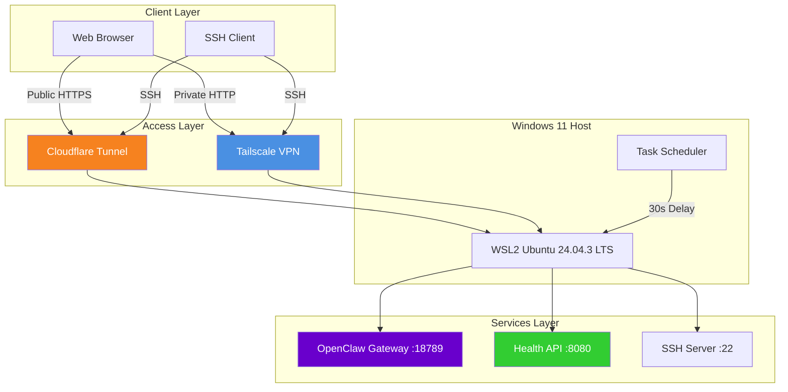
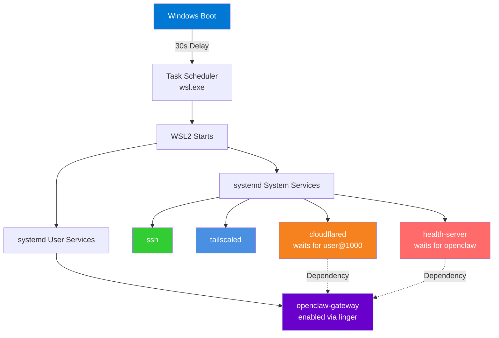
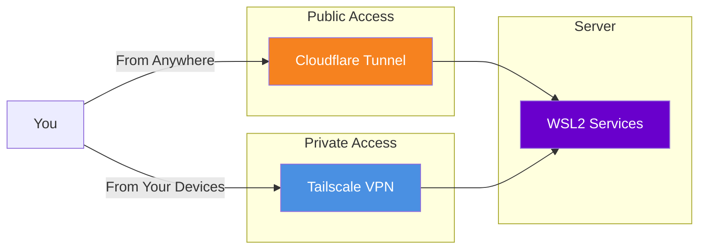

# 🤖 ASUS-VivoBookS15 AI Server

> An old laptop, reborn as an AI agent orchestration hub with private VPN access, public tunnel reach, and 24/7 health monitoring.

[](https://health.droidvm.dev)
[](https://health.droidvm.dev)
[](https://openclaw.droidvm.dev)
[](https://health.droidvm.dev)
[](https://learn.microsoft.com/en-us/windows/wsl/)
[](LICENSE)
[](https://github.com/myselfshravan/lextex-homelab/stargazers)

---

## Quick Start

<details>
<summary>🚀 Access the live server right now</summary>

```bash
# Check if the server is online
curl -s https://health.droidvm.dev | jq .status

# Open the AI dashboard (requires device pairing)
open https://openclaw.droidvm.dev
```

> **Note:** SSH access is only available via Tailscale private VPN for security.
</details>

<details>
<summary>📖 Set up your own homelab</summary>

1. Clone this repo: `git clone https://github.com/myselfshravan/lextex-homelab.git`
2. Follow the [Complete Setup Guide](./system-setup-guide.md)
3. Configure your services and enjoy!

</details>

---

## The Setup

This is **not your average home server**. It's a WSL2-based AI orchestration platform that:

- 🔄 **Auto-starts on Windows boot** — No manual intervention needed
- 🌐 **Accessible from anywhere** — Private VPN + public tunnel
- 💚 **Self-monitoring** — Health API with connectivity checks
- 🤖 **Runs AI agents** — OpenClaw (Lexi) with web dashboard control
- 🛠️ **Claude Code powered** — AI-assisted development environment

---

## Architecture Overview


```mermaid
graph TB
    subgraph "Client Layer"
        Browser[Web Browser]
        Terminal[SSH Client]
    end

    subgraph "Access Layer"
        CF[Cloudflare Tunnel]
        TS[Tailscale VPN]
    end

    subgraph "Windows 11 Host"
        Task[Task Scheduler]
        WSL[WSL2 Ubuntu 24.04.3 LTS]
    end

    subgraph "Services Layer"
        OC[OpenClaw Gateway :18789]
        HS[Health API :8080]
        SSH[SSH Server :22]
    end

    Browser -->|Public HTTPS| CF
    Terminal -->|SSH| CF
    Browser -->|Private HTTP| TS
    Terminal -->|SSH| TS

    CF --> WSL
    TS --> WSL

    Task -->|30s Delay| WSL
    WSL --> OC
    WSL --> HS
    WSL --> SSH

    style CF fill:#f6821f,color:#fff
    style TS fill:#4a90e2,color:#fff
    style OC fill:#6900cc,color:#fff
    style HS fill:#32cd32,color:#fff
```

---

## Service Stack

| Component | What | How |
|-----------|------|-----|
| **Hardware** | ASUS VivoBook S15 | Intel i5-12500H (12 cores), 16GB RAM |
| **OS** | Ubuntu 24.04.3 LTS | Running on WSL2 (12GB RAM allocated) |
| **AI** | OpenClaw v2026.3.8 | 9 specialized AI agents including fraud detection |
| **VPN** | Tailscale | Private mesh network (100.85.179.13) |
| **Tunnel** | cloudflared | Public access via droidvm.dev |
| **Health** | Custom Python API | Real-time monitoring at `/health` |
| **Dev** | Claude Code | AI-powered development CLI |

---

## Services at a Glance

| Service | Port | Access | Purpose |
|---------|------|--------|---------|
| **OpenClaw Gateway** | 18789 | [openclaw.droidvm.dev](https://openclaw.droidvm.dev) | AI agent dashboard |
| **Health API** | 8080 | [health.droidvm.dev](https://health.droidvm.dev) | System monitoring |
| **SSH Server** | 22 | Tailscale only (private) | Secure remote shell |
| **Tailscale VPN** | 41641 | `asus-vivobooks15-1` | Private network access |

---

## Auto-Start Chain


```mermaid
flowchart TD
    A[Windows Boot] -->|30s Delay| B[Task Scheduler<br/>wsl.exe]
    B --> C[WSL2 Starts]
    C --> D[systemd System Services]
    C --> E[systemd User Services]

    D --> D1[ssh]
    D --> D2[tailscaled]
    D --> D3[cloudflared<br/>waits for user@1000]
    D --> D4[health-server<br/>waits for openclaw]

    E --> E1[openclaw-gateway<br/>enabled via linger]

    D3 -.->|Dependency| E1
    D4 -.->|Dependency| E1

    style A fill:#0078d4,color:#fff
    style D1 fill:#32cd32,color:#fff
    style D2 fill:#4a90e2,color:#fff
    style D3 fill:#f6821f,color:#fff
    style D4 fill:#ff6b6b,color:#fff
    style E1 fill:#6900cc,color:#fff
```

---

## Dual Access Layer


```mermaid
graph LR
    subgraph "Public Access"
        CF[Cloudflare Tunnel]
    end

    subgraph "Private Access"
        TS[Tailscale VPN]
    end

    subgraph "Server"
        SRV[WSL2 Services]
    end

    User[You] -->|From Anywhere| CF
    User -->|From Your Devices| TS

    CF --> SRV
    TS --> SRV

    style CF fill:#f6821f,color:#fff
    style TS fill:#4a90e2,color:#fff
    style SRV fill:#6900cc,color:#fff
```

**Tailscale** — Secure, keyless SSH within your tailnet
**Cloudflare** — Public access from anywhere in the world

---

## Access Your Server

### From Anywhere (Public - HTTP Services Only)

```bash
# Check health status
curl https://health.droidvm.dev | jq .

# Access AI dashboard (requires device pairing)
open https://openclaw.droidvm.dev
```

### Secure Shell Access (Tailscale Private VPN Only)

```bash
# SSH via VPN
ssh lextex@asus-vivobooks15-1
# or by IP:
ssh lextex@100.85.179.13

# Direct access to services
http://100.85.179.13:18789  # OpenClaw
http://100.85.179.13:8080   # Health API
```

---

## Health Monitor

The server runs a custom health monitoring API at [`https://health.droidvm.dev`](https://health.droidvm.dev).

**What it checks:**

- ✅ System uptime & load averages
- ✅ Memory & disk usage
- ✅ Service status (SSH, Tailscale, Cloudflare, OpenClaw)
- ✅ OpenClaw gateway connectivity & response time
- ✅ External connectivity (DNS servers)

**Sample output:**

```json
{
  "host": "ASUS-VivoBookS15",
  "status": "healthy",
  "timestamp": 1773096911,
  "uptime": "4h 24m",
  "load": {"1m": 0.59, "5m": 0.2, "15m": 0.1},
  "memory": {
    "total_mb": 11961,
    "used_mb": 3610,
    "available_mb": 8351,
    "usage_pct": 30.2
  },
  "services": {
    "openclaw-gateway": {"running": true, "status": "active"},
    "tailscaled": {"running": true, "status": "active"},
    "cloudflared": {"running": true, "status": "active"}
  },
  "openclaw": {
    "gateway_reachable": true,
    "response_time_ms": 6.7,
    "api_healthy": true
  },
  "overall_healthy": true
}
```

---

## AI Agent Platform: OpenClaw (Lexi)

The server runs **OpenClaw**, featuring **Lexi** - an intelligent AI agent platform with 9 specialized agents and advanced business automation.

**Access:** [`https://openclaw.droidvm.dev`](https://openclaw.droidvm.dev)

**Lexi's Ecosystem:**
- 🧠 Multi-model AI (Zai GLM-4.7, Groq Llama, Ollama)
- 💬 Multi-channel integration (WhatsApp, Telegram, Slack)
- 🔌 MCP server support with database integrations
- 🎯 Custom skills and business automation tools
- 🤖 **9 specialized agents** with intelligent routing
- 📊 **Real-time business intelligence** and data analysis
- 🔄 **30+ active sessions** with continuous learning

**First-time setup:**
1. Open the dashboard
2. Approve the device pairing from the server:
   ```bash
   openclaw devices list
   openclaw devices approve <request-id>
   ```

---

## What Makes This Legendary

### 1. WSL2 as a Server Platform
Running a full server stack on WSL2 is unconventional, but it works beautifully:
- **Windows integration** — Auto-start via Task Scheduler
- **Linux power** — Full systemd, containers, native tooling
- **Resource flexibility** — Adjustable RAM/CPU via `.wslconfig`

### 2. Health-First Design
Every service is monitored:
- **Passive checks** — Is the process running?
- **Active checks** — Can we reach the HTTP endpoint?
- **Dependency checks** — Are required services up first?

The health API even validates **external connectivity** by checking DNS servers.

### 3. Claude Code Integration
Development is AI-assisted:
```bash
# Claude Code runs natively in WSL2
claude-code --help

# Your AI server helps you build on itself
```

---

## Quick Commands

> **Note:** SSH commands require Tailscale VPN connection

```bash
# Check system health (public)
curl https://health.droidvm.dev | jq .overall_healthy

# SSH into the server (via Tailscale)
ssh lextex@asus-vivobooks15-1

# Restart OpenClaw (via Tailscale)
ssh lextex@asus-vivobooks15-1 "systemctl --user restart openclaw-gateway"

# View OpenClaw logs (via Tailscale)
ssh lextex@asus-vivobooks15-1 "journalctl --user -u openclaw-gateway -f"

# Check Tailscale status
tailscale status
```

---

## Development

Want to set this up yourself? See the **[Complete Setup Guide](./system-setup-guide.md)** for:

- Windows & WSL2 configuration
- Ubuntu base setup
- Service installation (Tailscale, Cloudflare, OpenClaw)
- Auto-start configuration
- Migration guide

---

## Project Structure

```
lextex-homelab/
├── README.md                    # This file
├── CONTRIBUTING.md              # Contribution guidelines
├── SECURITY.md                  # Security policy
├── LICENSE                      # MIT License
├── system-setup-guide.md        # Complete technical guide
├── health_server.py             # Health monitoring API
├── wsl.config.example           # WSL2 resource configuration
└── services/                    # systemd service templates
    ├── system/
    │   ├── cloudflared.service.example
    │   └── health-server.service.example
    └── user/
        └── openclaw-gateway.service.example
```

---

## System Requirements

| Component | Minimum | Recommended |
|-----------|---------|-------------|
| RAM | 8 GB | 16 GB |
| CPU | 4 cores | 8+ cores |
| Storage | 50 GB | 100+ GB SSD |
| OS | Windows 11 | Windows 11 22H2+ |

---

## Contributing

Found a bug or have a feature idea? Feel free to open an issue or submit a PR!

---

## License

This project is licensed under the MIT License - see the [LICENSE](LICENSE) file for details.

---

## Acknowledgments

- **[OpenClaw](https://github.com/openclaw-org/openclaw)** — The AI agent framework
- **[Tailscale](https://tailscale.com/)** — The mesh network that just works
- **[Cloudflare](https://developers.cloudflare.com/cloudflare-one/connections/connect-apps/)** — The tunnel that makes public access trivial
- **[WSL2](https://learn.microsoft.com/en-us/windows/wsl/)** — For making Linux-on-Windows actually usable
- **[Claude Code](https://claude.ai/code)** — AI-powered development CLI

---

**Built with ❤️ and too much caffeine**
